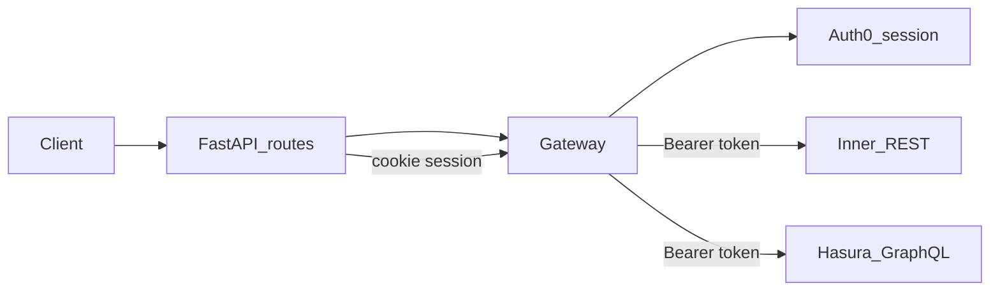

# cardio-trace-gateway

FastAPI **Backend-for-Frontend (BFF)** and **API gateway** for the Cardio Trace React SPA: one origin for Auth0 login flows, invite orchestration, and authenticated HTTP proxying to the inner REST API and Hasura GraphQL.

## Role

- **Edge integration** — Auth0-facing login, callback, and logout; session material in an **encrypted HttpOnly cookie** (per [ADR 0003](../cardio-trace-platform-architecture/docs/adr/0003-auth-token-handling.md)); the SPA does not send `Authorization: Bearer`; the gateway decrypts the session and attaches **`Authorization: Bearer <access_token>`** to upstream calls.
- **REST proxy** — Forwards application traffic to the core backend (e.g. Django DRF) under a configured base URL.
- **GraphQL proxy** — Forwards to **Hasura** on a dedicated URL (e.g. `/graphql` → Hasura); Hasura runs as a **separate process** in the gateway stack, not inside Python ([ADR 0009](../cardio-trace-platform-architecture/docs/adr/0009-graphql-hasura-gateway-placement.md)).

The gateway **orchestrates and proxies**; it does **not** own domain business rules—that stays in core backend, Hasura metadata/RBAC, and other services ([ADR 0008](../cardio-trace-platform-architecture/docs/adr/0008-gateway-bff-api-aggregator.md)).

## Request flow 




## Architecture notes

Implementation follows a composed **`Gateway`** facade with namespaced pieces: **`auth`** (Auth0 session / `ServerClient`), **`invites`** (Auth0 Management–backed invite flows), and **`router`** (reverse proxy to inner REST and GraphQL). Route handlers stay thin; proxy responses are built as proper Starlette responses. Configuration includes inner REST base URL and **`HASURA_GRAPHQL_URL`** for GraphQL forwarding.

## Development

This project uses **[uv](https://docs.astral.sh/uv/)** for environments and dependency management (see [`pyproject.toml`](pyproject.toml) and the lockfile [`uv.lock`](uv.lock)).

From the repository root:

```bash
uv sync
```

That creates or updates `.venv`, installs the project in editable mode, and resolves dependencies from the lockfile.

Run the app (after configuring `.env`):

```bash
uv run fastapi dev app.main:app --reload
```

Add or upgrade a dependency and refresh the lockfile:

```bash
uv add <package>
# or edit pyproject.toml, then:
uv lock
uv sync
```

## Testing

Install test dependencies:

```bash
uv sync --group dev
```

Run the CI-friendly test command (includes coverage gate at 80% for gateway/security modules):

```bash
uv run pytest
```


## Platform ADRs

Authoritative decisions live under **`cardio-trace-platform-architecture/docs`** (e.g. `docs/adr/0003-auth-token-handling.md`, `0008-gateway-bff-api-aggregator.md`, `0009-graphql-hasura-gateway-placement.md`, plus IdP, tenancy, roles, and invitations).
