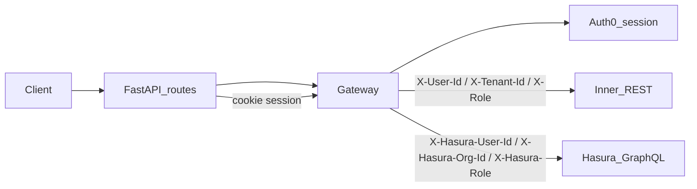

# cardio-trace-gateway

FastAPI **Backend-for-Frontend (BFF)** and **API gateway** for the Cardio Trace React SPA: one origin for Auth0 login flows, invite orchestration, and authenticated HTTP proxying to the inner REST API and Hasura GraphQL.

## Role

- **Edge integration** — Auth0-facing login, callback, and logout; session material in an **encrypted HttpOnly cookie** (per [ADR 0003](docs/adr/0003-auth-token-handling.md)); the SPA does not send `Authorization: Bearer`; the gateway decrypts the session and forwards only trusted identity headers to upstream services.
- **REST proxy** — Forwards application traffic to the core backend (e.g. Django DRF) under a configured base URL.
- **GraphQL proxy** — Forwards to **Hasura** on a dedicated URL (e.g. `/graphql` → Hasura); Hasura runs as a **separate process** in the gateway stack, not inside Python ([ADR 0009](docs/adr/0009-graphql-hasura-gateway-placement.md)).

The gateway **orchestrates and proxies**; it does **not** own domain business rules—that stays in core backend, Hasura metadata/RBAC, and other services ([ADR 0008](docs/adr/0008-gateway-bff-api-aggregator.md)).

## Request flow 




## Architecture notes

Implementation follows a composed **`Gateway`** facade with namespaced pieces: **`auth`** (Auth0 session / `ServerClient`), **`invites`** (Auth0 Management–backed invite flows), and **`router`** (reverse proxy to inner REST and GraphQL). Route handlers stay thin; proxy responses are built as proper Starlette responses. Configuration includes inner REST base URL and **`HASURA_GRAPHQL_URL`** for GraphQL forwarding.

The proxy boundary intentionally excludes browser bearer tokens and cookie forwarding. Browser request headers are allowlisted, and the gateway injects internal trust headers only (see [ADR 0011](docs/adr/0011-gateway-redirect-and-header-policy.md) and [ADR 0012](docs/adr/0012-gateway-backend-trust-contract.md)).

For cookie-backed browser sessions, unsafe REST methods (`POST`, `PUT`, `PATCH`, `DELETE`) and GraphQL `POST` enforce a double-submit CSRF check (`gateway_csrf` cookie + `X-CSRF-Token` header), as defined by [ADR 0010](docs/adr/0010-gateway-csrf-double-submit.md).

## Edge RBAC

The gateway enforces coarse RBAC at the edge before proxying to internal services. Enforcement is backed by Casbin:

- model: `src/app/gateway/rbac_model.conf`
- policy: `src/app/gateway/rbac_policy.csv`

Requests that fail RBAC checks return HTTP `403` with code `rbac_denied` in enforce mode.

RBAC mode and policy locations are configurable via environment variables:

- `RBAC_ENFORCEMENT_MODE` (`audit` default, `enforce` to block)
- `RBAC_MODEL_PATH` (optional path override for Casbin model file)
- `RBAC_POLICY_PATH` (optional path override for Casbin policy file)

In `audit` mode, violations are logged and requests continue. In `enforce` mode, violations are blocked before proxying. Fine-grained, record-level authorization remains in downstream DRF and Hasura services.

## Development

This project uses **[uv](https://docs.astral.sh/uv/)** for environments and dependency management (see [`pyproject.toml`](pyproject.toml) and the lockfile [`uv.lock`](uv.lock)).

From the repository root:

```bash
uv sync
```

That creates or updates `.venv`, installs the project in editable mode, and resolves dependencies from the lockfile.

Run the app (after configuring `.env`):

```bash
uv run fastapi dev app.main:app --reload
```

## Docker

Build the image:

```bash
docker build -t cardio-trace-gateway .
```

Run the container:

```bash
docker run --rm -p 8000:8000 --env-file .env cardio-trace-gateway
```

The container starts through `entrypoint.sh`, which launches Uvicorn with:
- app module: `app.main:app` (override with `APP_MODULE`)
- host: `0.0.0.0` (override with `HOST`)
- port: `8000` (override with `PORT`)
- log level: `info` (override with `LOG_LEVEL`)
- optional worker count via `WORKERS`

You can pass extra Uvicorn flags at runtime:

```bash
docker run --rm -p 8000:8000 --env-file .env cardio-trace-gateway --timeout-keep-alive 30
```

Add or upgrade a dependency and refresh the lockfile:

```bash
uv add <package>
# or edit pyproject.toml, then:
uv lock
uv sync
```

## Testing

Install test dependencies:

```bash
uv sync --group dev
```

Run tests locally (default; includes coverage gate at 80% for gateway/security modules):

```bash
uv run pytest -m "not integration"
```

`asyncio_mode = "strict"` is enabled, so async tests must be explicitly marked:

- `@pytest.mark.asyncio` on each async test, or
- `pytestmark = pytest.mark.asyncio` at module level.

Run the full suite (unit + integration):

```bash
uv run pytest
```

Run integration tests against staging services:

```bash
RUN_INTEGRATION=1 uv run pytest --no-cov -m integration
```

If you hit `Runner.run() cannot be called from a running event loop`, run unit/contract
and integration tests separately as shown above.

Integration tests require these environment variables:

- `INTEGRATION_AUTH0_DOMAIN`
- `INTEGRATION_INNER_SERVICE_URL`
- `INTEGRATION_HASURA_URL`
- `INTEGRATION_EXAMPLE_ACCESS_TOKEN`

Optional integration variables:

- `INTEGRATION_GATEWAY_BASE_URL` (if omitted, tests try to start a local gateway on `localhost:8000`)
- `INTEGRATION_AUTH0_CALLBACK_QUERY` (`code=...&state=...` for callback test)
- `INTEGRATION_SESSION_COOKIE` (raw cookie header value for authenticated proxy tests)
- `INTEGRATION_CSRF_TOKEN` (for CSRF-success mutation test)
- `INTEGRATION_INNER_PROBE_PATH` (default: `health`)
- `INTEGRATION_GRAPHQL_PROBE_QUERY` (default: `{__typename}`)


## Platform ADRs

Authoritative decisions live in this repository under **`docs/adr`** (e.g. `0003-auth-token-handling.md`, `0008-gateway-bff-api-aggregator.md`, `0009-graphql-hasura-gateway-placement.md`, plus IdP, tenancy, roles, invitations, CSRF, redirect/header policy, and trust contract ADRs).
